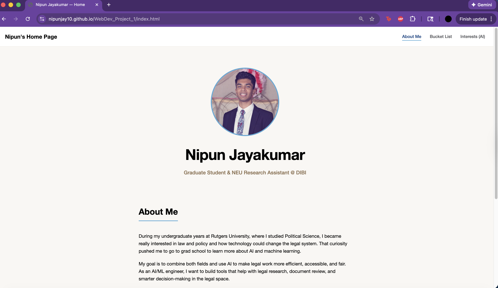
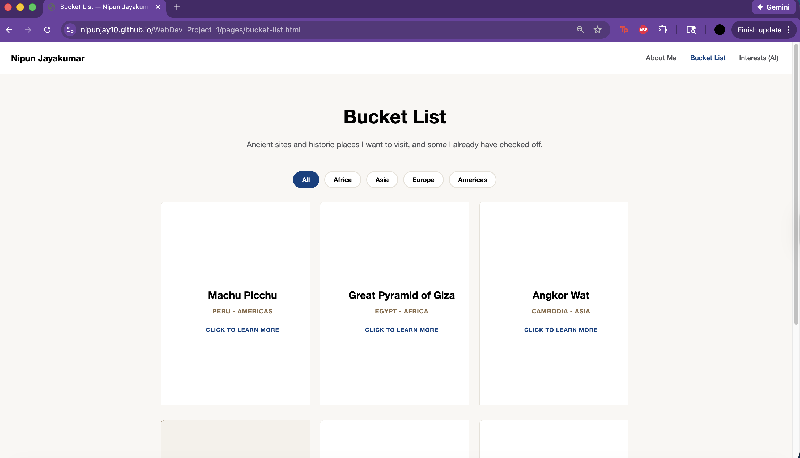
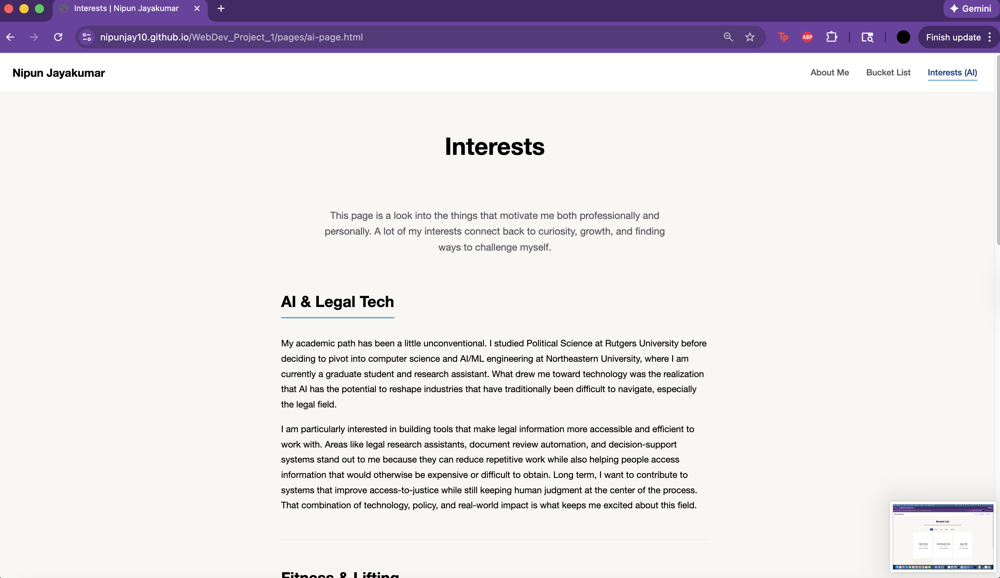

# Nipun Jayakumar — Personal Homepage

A personal homepage built with HTML5, CSS3, and vanilla JavaScript (ES6 modules), featuring an interactive bucket list with location filtering and flip-card animations.

URL: <https://nipunjay10.github.io/WebDev_Project_1/>

## Project Objective

This is my multi-page personal homepage built for CS5610 Web Development at Northeastern University. It introduces who I am, my interests in AI/legal tech and personal hobbies, and a historical bucket list of places I want to visit. The site uses a minimalist off-white palette with light blue and warm brown accents, paired with interactive flip cards on the bucket list page.

## Pages

- **About Me**: Introduction, my journey from Political Science at Rutgers to AI/ML at Northeastern, plus contact info
- **Bucket List**: Historical sites I want to visit (and one I already have), filterable by continent with click to flip cards revealing photos, historical context, and reasons to why I want to visit
- **Interests(AI)**: AI-generated interests page covering my professional and personal interests, from AI in legal tech to travel

## Tech Stack

- **HTML5** — semantic markup
- **CSS3** — custom properties, grid, flexbox, 3D transforms
- **Vanilla JavaScript (ES6 modules)** — DOM manipulation, event handlers, class toggling
- **ESLint + Prettier** — code quality and formatting

## How to View

This is a pure static HTML/CSS site. Just click on the URL to view it and interact with the site.
URL: <https://nipunjay10.github.io/WebDev_Project_1/>

DEMO: <https://www.youtube.com/watch?v=Z03BoEdL_ew>
SLIDES: <https://docs.google.com/presentation/d/1bRmfHa6qyVhE3bBQgxgiCWYLpacGt-TbzB3Zhi_F3O8/edit?usp=sharing>

## Screenshots

### About Me



### Bucket List



### Interests (AI)



## Project Structure

```
WebDev_Project_1/
├── index.html              # About Me page
├── pages/
│   ├── bucket-list.html    # Bucket List page with filter & flip cards
│   └── ai-page.html        # Interests page (AI-generated)
├── css/
│   └── style.css           # All site styling
├── js/
│   └── bucket-list.js      # Filter + flip-card logic
├── images/                 # Photos of historical sites & headshot
├── README.md
├── LICENSE                 # MIT
├── package.json            # Dev dependencies
└── eslint.config.js        # ESLint config
```

## Author

Nipun Jayakumar
[Personal Homepage](https://nipunjay10.github.io/WebDev_Project_1/)
[LinkedIn](https://www.linkedin.com/in/nipun-jayakumar-9bba13154/)
[GitHub](https://github.com/nipunjay10)

## Use of GenAI Tools

This section discloses where generative AI was used in this project.

1. **Interests page generation** — `pages/ai-page.html` was generated by ChatGPT using a detailed prompt that specified the required HTML structure, navigation, semantic tags, technical requirements (one `<h1>`, no IDs, no `!important`, alt text, etc.), and the content I wanted covered (AI/legal tech, fitness, snowboarding, basketball, travel). I provided the bio context, structure, and tone direction; the AI produced the page based on those constraints.

Prompt used: I need you to generate a complete, self-contained HTML page for a personal portfolio website. The page is titled "Interests" and is part of a class project where this third page must be entirely AI-generated. Context about me - integrate with content: My name is Nipun Jayakumar, a graduate student and research assistant at Northeastern University. I have an undergraduate background in Political Science from Rutgers and am pivoting to AI/ML engineering by pursuing a degree in comp sci. My long-term goal is to build AI tools for the legal industry like legal research assistants, document review automation, and decision-support systems. Outside of school, I'm into snowboarding, basketball, weight lifting, and travel. What to generate: A personal "Interests" page that mixes my professional interests with my personal hobbies, written in first-person as if I wrote it. Structure it with these sections: A short page intro (1-2 sentences) framing the page as a window into both what I do and what I love. AI & Legal Tech : 1-2 paragraphs on why I'm pivoting toward AI/ML and specifically toward applying it to the legal field. Touch on areas like legal research assistants, document review, or access-to-justice. Fitness & Lifting: 1 paragraph on my interest in weight lifting and how I approach training. Snowboarding: 1 paragraph on why I love it. Basketball: 1 paragraph on what I enjoy about the sport. Mention my love for the knicks and their historic playoff run in 2026. Travel: 1-2 paragraphs on travel as a way to learn cultures and history, mentioning the bucket list tab in the site to look more into it. A short closing paragraph tying the personal and professional sides together. Write in a warm, personal voice. Avoid cliches phrases that sound ai, make it sounds human Technical requirements (very important — these are graded): Use only one h1 on the page, the page title "Interests". Use h2 for section headings. Use semantic HTML tags where appropriate (main, section, header). Use CSS classes to identify elements. No inline styles. No !important anywhere. The page must include a nav bar at the top that matches my existing structure: "Nipun Jayakumar" logo on the left linking to ../index.html, and three nav links on the right: "About Me" to ../index.html, "Bucket List" to bucket-list.html, "Interests (AI)" to ai-page.html (this current page should be marked active with class="active"). The page must link to my existing CSS file at ../css/style.css in the head. Include standard meta tags: charset, viewport, author (my name), description. All HTML should be valid and pass W3C validation. Don't include any js on this page. Don't add script tags or external libraries. Don't generate any CSS as I have my own stylesheet and will style new classes myself. Use class names consistent with my existing site where possible for the title block. For new sections, use simple descriptive names like block or section. I can input my other html pages as a reference if need be. Output the complete HTML file as a single code block in this chat.

2. **Build guidance and debugging** — Throughout the project, I used Claude to walk through HTML/CSS concepts, debug layout issues (flip-card 3D transforms, grid alignment), and refine wording on bio and bucket list content. All decisions, structure, and code were reviewed and modified by me.

## Image References

Historical Sites

- Petra: Wikipedia
- Giza: Wikipedia
- Peru: Wikipedia
- Mexico: Wikipedia
- Rome: Wikipedia
- Cambodia: Wikipedia

## License

This project is licensed under the MIT License. See [LICENSE](LICENSE) for details.
